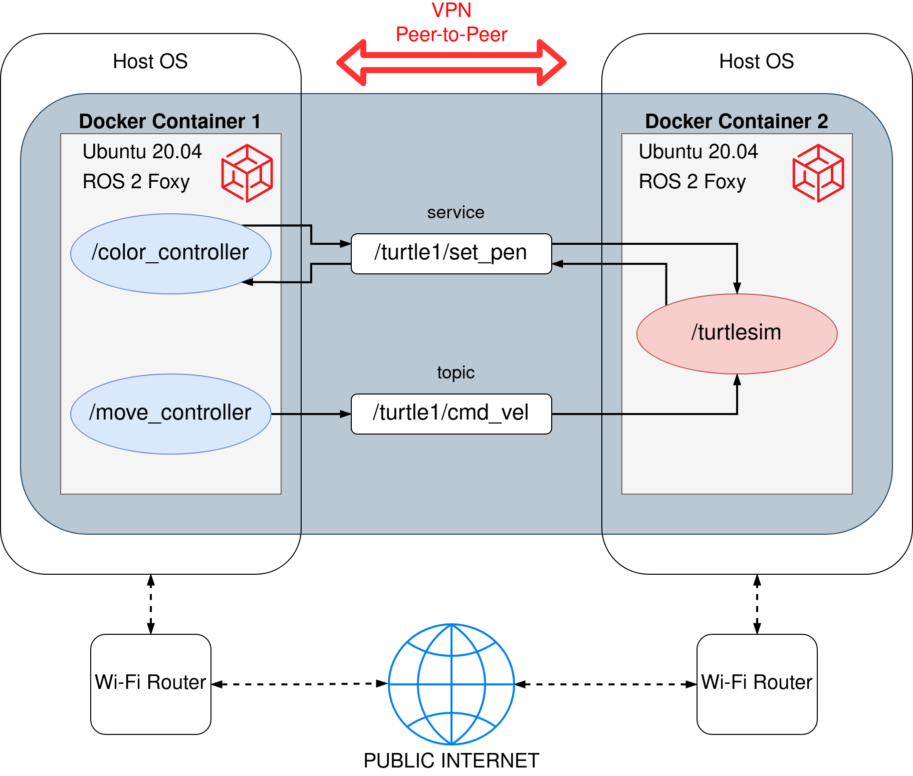
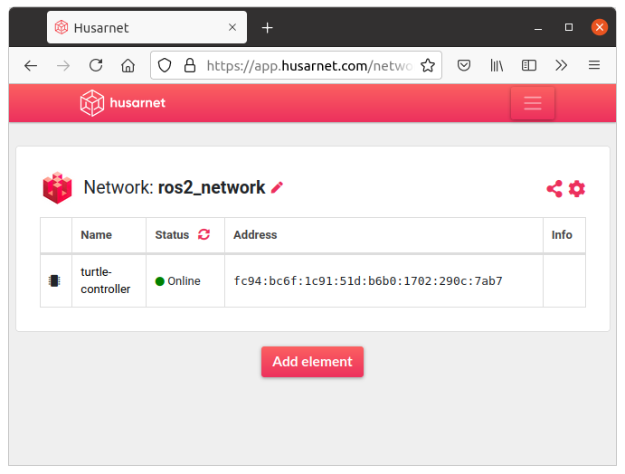
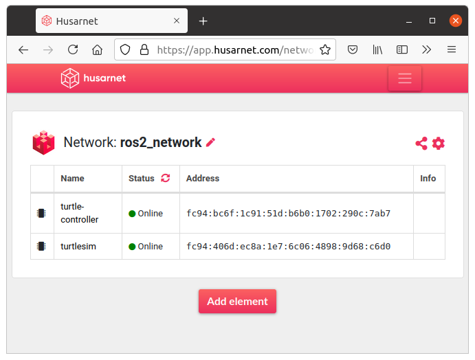
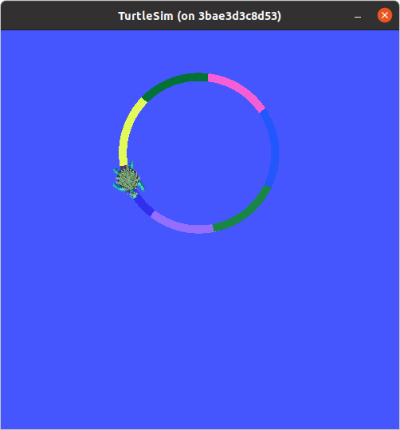
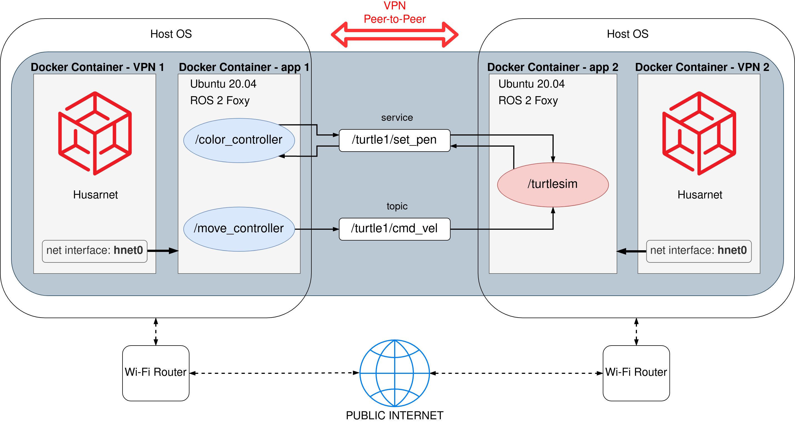
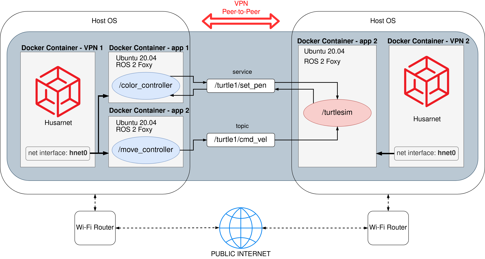

# ros2_docker_examples

This repo shows few different ways to deal with ROS 2 node interconnectivity depending whether you:

- use nodes on a single machine or on multiple machines
- use nodes with or without docker
- connect ROS 2 nodes over LAN or WAN

To focus purely on connectivity, not on running fancy ROS 2 software or robots in Gazebo, I will go through different scenarios based on a simple ROS 2 system containing of 3 nodes:

- `/turtlesim` - a very simple, simulator for learning ROS where you simulate ... a turtle :)
- `/move_controller` - node for controlling the movement of the turtle
- `/color_controller` - node that is changing the color of the line drawn by a turtle each second

The solution is scalable, so what you will learn can be applied in very complex distributed ROS 2 systems as well!

Below, there are 4 example use cases using the same code base, launched in different architecture scenarios.

-------------
## Before you start ...

Make sure you have Docker and Docker-Compose installed on your laptop. 

[The official instruction](https://docs.docker.com/get-docker/) is the best tutorial but here's a quick rundown for you (for Linux):

```bash
sudo -E apt-get -y install apt-transport-https ca-certificates software-properties-common && \
curl -sL https://download.docker.com/linux/ubuntu/gpg | sudo apt-key add - && \
arch=$(dpkg --print-architecture) && \
sudo -E add-apt-repository "deb [arch=${arch}] https://download.docker.com/linux/ubuntu $(lsb_release -cs) stable" && \
sudo -E apt-get update && \
sudo -E apt-get -y install docker-ce docker-compose
```

```bash
sudo systemctl daemon-reload
sudo systemctl restart docker
```

ROS 2 Foxy installed on your laptop is needed only for **[Eg. 0]** section.


## [Eg. 0] Running without Docker


```bash
cd ros2_ws
colcon build

source /opt/ros/foxy/setup.bash
source install/setup.bash # full path might be: ~/ros2_docker_examples/ros2_ws/install/setup.bash

ros2 launch my_turtle_bringup turtlesim_demo.launch.py
```


## [Eg. 1] Running in a single container


**Please stay in `ros2_docker_examples/` directory while executing those commands:**

```
sudo chmod +x eg1/ros_entrypoint.sh

docker build -t turtle_demo -f eg1/Dockerfile .

xhost local:root

sudo docker run --rm -it \
--env DISPLAY \
--volume /tmp/.X11-unix:/tmp/.X11-unix:rw \
turtle_demo \
ros2 launch my_turtle_bringup turtlesim_demo.launch.py
```

## [Eg. 2] Running in two containers (using `docker-compose`)


```bash
cd eg2
docker-compose up --build
```

## [Eg. 3] PROBLEM: Running on two computers in different networks


Because two ROS 2 devices are in different networks, DDS can not perform auto-discovery.

Also devices can not reach each other because they do not have neither public nor static IP addresses and are behind Wi-Fi router NAT.

## [Eg. 3] SOLUTION: Connecting ROS 2 machines using VPN



Ready to use example is available in `eg3/` folder. There are two separate subfolders with a `docker-compose.yml` file which should be launched on two separate devices from different networks.

### Connecting containers to the same VPN network

At first modify `eg3/dev1/.env` and `eg3/dev2/.env` files by providing the same Husarnet network Join Code there. 

```
JOINCODE=fc94:b01d:1803:8dd8:b293:5c7d:7639:932a/xxxxxxxxxxxxxxxxxxxxxx
HOSTNAME=turtle-controller
```

You will find your Join Code at **https://app.husarnet.com  
 -> Click on the desired network  
 -> `Add element` button  
 -> `Join Code` tab** 

1. Start the first device:

```bash
cd eg3/dev1
docker-compose up --build
```

After a while you should see your first device connected to the Husarnet network:



2. Add the first device address to Peers list of the second device, by editing: `eg3/dev2/cyclonedds.xml` file:

```xml
...
<Discovery>
    <Peers>
        <Peer address="fc94:bc6f:1c91:51d:b6b0:1702:290c:7ab7"/>
    </Peers>
    <ParticipantIndex>auto</ParticipantIndex>
</Discovery>
        ...
```

3. Start the second device:

```bash
cd eg3/dev2
docker-compose up --build
```

You should see now two devices in the Dashboard:



Problem: turtle is not moving!
Solution: while starting `dev1` we didn't new the IPv6 address of the second device, but we know it now.

4. Kill `Docker-Compose` on the first device (`ctrl` + `c`). Add the seconds device address to the Peers list of the first device, by editing: `eg3/dev1/cyclonedds.xml` file:

```xml
...
<Discovery>
    <Peers>
        <Peer address="fc94:406d:ec8a:1e7:6c06:4898:9d68:c6d0"/>
    </Peers>
    <ParticipantIndex>auto</ParticipantIndex>
</Discovery>
...
```

5. Restart the first device container and everything looks fine now:

```bash
cd eg3/dev1
docker-compose up --build
```




-------
It works, but there are a few things that we don't like:

- we don't know IPv6 addressed of the containers before starting them. So we need to make a dummy start of the first container, just to get the IPv6 address to be written in `cyclonedds.xml` of the second container.

- we need to modify containers that we already have to connect them over the Internet (installing VPN client within a containers)

We will fix those issues in the example number 4.s

## [Eg. 4] Using a separate VPN container

Instead of modyfing your own containers, you can launch a separate official [Husarnet VPN container](https://hub.docker.com/r/husarnet/husarnet) next to your existing app container.

`hnet0` network interface from Husarnet container is shared with any container you specify in the `docker-compose.yml`. Thanks to that without modyfying your exisitng container with ROS 2 nodes, you can connect them with remote nodes without any effor.

Moreover instead of long IPv6 addresses you can use Husarnet hostnames of the Husarnet Container (specified in `eg4/dev*/.env` files).



That's a truely zero effort solution that simply works.

TL;DR:

### DEVICE 1

Clone this repo to the first device, then execute in the terminal:

```bash
cd ros2_docker_examples/eg4/dev1

# Add your own join code to the .env file in the current directory.
# Example .env file content:
#
# JOINCODE=fc94:b01d:1803:8dd8:b293:5c7d:7639:932a/tTZtwiqM59iXtnCWABUEKH
# HOSTNAME=turtle-controller-1

docker-compose up --build
```

### DEVICE 2

Clone this repo to the second device, then execute in the terminal:

```bash
xhost local:root

cd ros2_docker_examples/eg4/dev2

# Add your own join code to the .env file in the current directory.
# Example .env file content:
#
# JOINCODE=fc94:b01d:1803:8dd8:b293:5c7d:7639:932a/tTZtwiqM59iXtnCWABUEKH
# HOSTNAME=turtlesim-1

docker-compose up --build
```

### Result:


Note that we haven't modified `cyclonedds.xml` file, because we specified there hostnames of Husarnet containers (in `.env` file) insted of IPv6 address.

--------------------

OK, pretty nice, but we still needed to create a custom Dockerfile even for just running a turtlesime. Our next goal is to find a way to do not build a special Docker Images "working with Husarnet", but run any existing ROS 2 image, by just applying the proper configuration in the `Docker Compose`.

## [Eg. 5] Run VPN network without modyfing existing Docker images

### DEVICE 1

```bash
cd ros2_docker_examples/eg5/dev1

# Add your own join code to the .env file in the current directory.
# Example .env file content:
#
# JOINCODE=fc94:b01d:1803:8dd8:b293:5c7d:7639:932a/tTZtwiqM59iXtnCWABUEKH
# HOSTNAME=turtle-controller-2

docker-compose up --build
```

### DEVICE 2

Clone this repo to the second device, then execute in the terminal:

```bash
xhost local:root

cd ros2_docker_examples/eg5/dev2

# Add your own join code to the .env file in the current directory.
# Example .env file content:
#
# JOINCODE=fc94:b01d:1803:8dd8:b293:5c7d:7639:932a/tTZtwiqM59iXtnCWABUEKH
# HOSTNAME=turtlesim-2

docker-compose up --build
```

### Result:

The same :)

--------------------

OK, so we can run our system containing 3 containers on two machines. It's completely fine, but to make our system more understabable by only reading a `docker-compose.yml`, instead of running a single `turtle_controller` container, we can run all ROS nodes in the separate containers.

## [Eg. 6] Running all ROS 2 nodes in separate containers



### DEVICE 1

```bash
cd ros2_docker_examples/eg6/dev1

# Add your own join code to the .env file in the current directory.
# Example .env file content:
#
# JOINCODE=fc94:b01d:1803:8dd8:b293:5c7d:7639:932a/tTZtwiqM59iXtnCWABUEKH
# HOSTNAME=turtle-controller-6

docker-compose up --build
```

### DEVICE 2

Clone this repo to the second device, then execute in the terminal:

```bash
xhost local:root

cd ros2_docker_examples/eg6/dev2

# Add your own join code to the .env file in the current directory.
# Example .env file content:
#
# JOINCODE=fc94:b01d:1803:8dd8:b293:5c7d:7639:932a/tTZtwiqM59iXtnCWABUEKH
# HOSTNAME=turtlesim-6

docker-compose up --build
```

### Result:

The same :)

--------------------

Our network works pretty well, configuration is nice, however if we would like to add 3rd device to the network, we would need to add new Peer's hostname in `cyclonedds.xml` files of 1st and 2nd device. In the next example we will introduce a separate `DDS updater` container that will update a Peer's list automatically by using `/etc/hosts` file being updated by Husarnet VPN.


....TODO