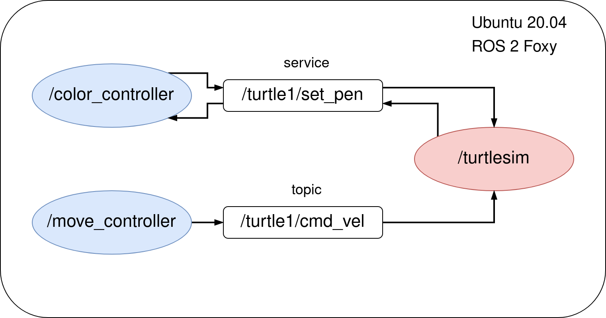
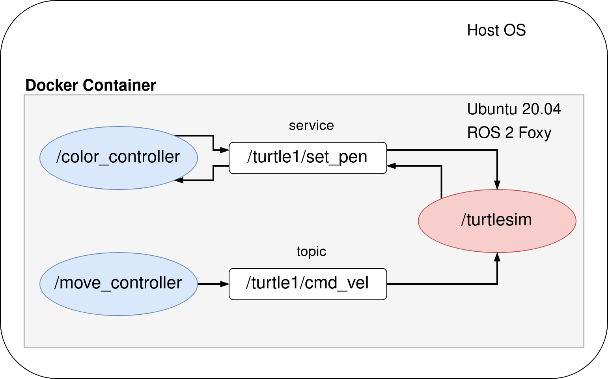
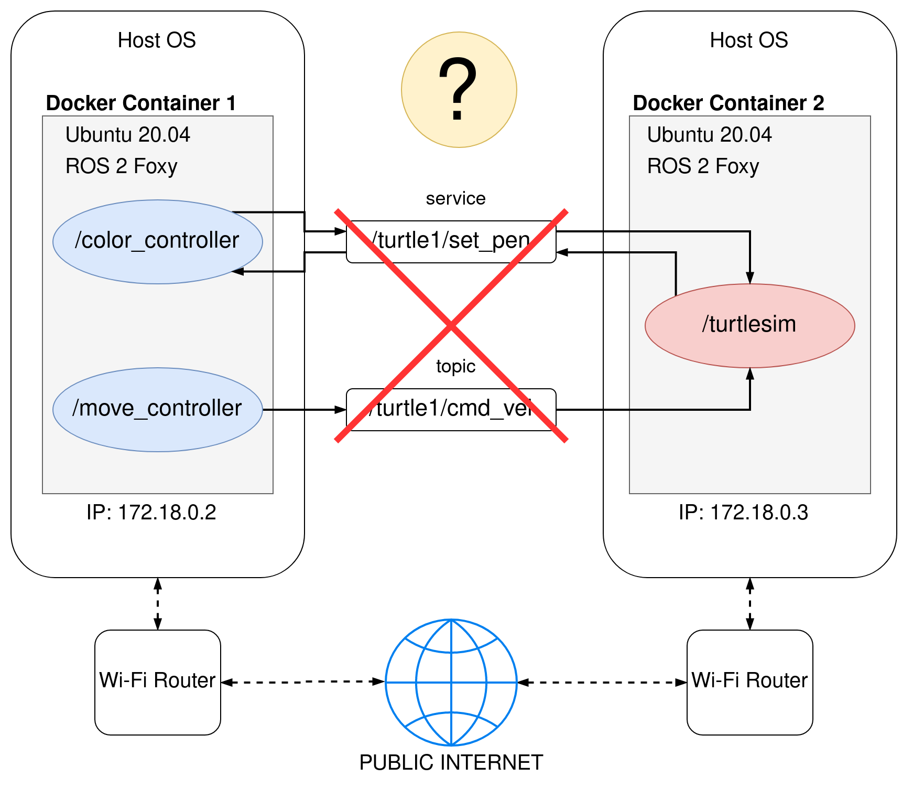
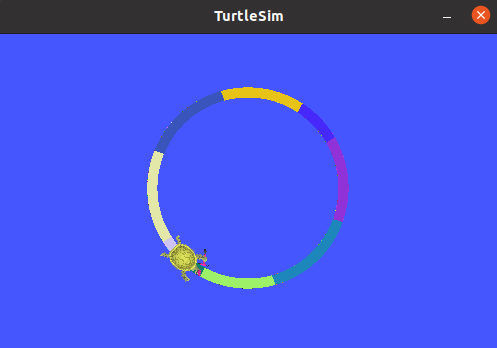
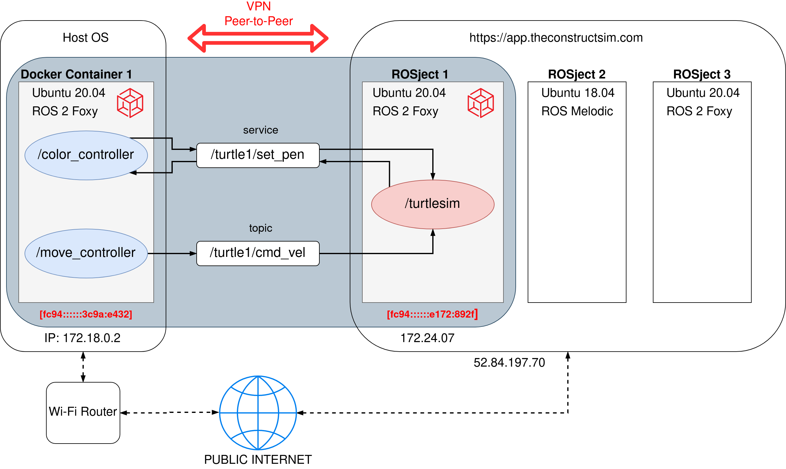

# ros2_docker_examples

This repo shows few different ways to deal with ROS 2 node interconnectivity depending whether you:

- use nodes on a single machine or on multiple machines
- use nodes with or without docker
- connect ROS 2 nodes over LAN or WAN

To focus purely on connectivity, not on running fancy ROS 2 software or robots in Gazebo, I will go through different scenarios based on a simple ROS 2 system containing of 3 nodes:

- `/turtlesim` - a very simple, simulator for learning ROS where you simulate ... a turtle :)
- `/move_controller` - node for controlling the movement of the turtle
- `/color_controller` - node that is changing the color of the line drawn by a turtle each second

The solution is scalable, so what you will learn can be applied in very complex distributed ROS 2 systems as well!

Below, there are 4 example use cases using the same code base, launched in different architecture scenarios.

-------------
## Before you start ...

Make sure you have Docker and Docker-Compose installed on your laptop. 

[The official instruction](https://docs.docker.com/get-docker/) is the best tutorial but here's a quick rundown for you (for Linux):

```bash
sudo -E apt-get -y install apt-transport-https ca-certificates software-properties-common && \
curl -sL https://download.docker.com/linux/ubuntu/gpg | sudo apt-key add - && \
arch=$(dpkg --print-architecture) && \
sudo -E add-apt-repository "deb [arch=${arch}] https://download.docker.com/linux/ubuntu $(lsb_release -cs) stable" && \
sudo -E apt-get update && \
sudo -E apt-get -y install docker-ce docker-compose
```

```bash
sudo systemctl daemon-reload
sudo systemctl restart docker
```

ROS 2 Foxy installed on your laptop is needed only for **[Eg. 0]** section.


## [Eg. 0] Running without Docker



```bash
cd ros2_ws
colcon build

source /opt/ros/foxy/setup.bash
source install/setup.bash # full path might be: ~/ros2_docker_examples/ros2_ws/install/setup.bash

ros2 launch my_turtle_bringup turtlesim_demo.launch.py
```


## [Eg. 1] Running in a single container



**Please stay in `ros2_docker_examples/` directory while executing those commands:**

```
sudo chmod +x eg1/init-container.sh
sudo chmod +x eg1/ros_entrypoint.sh

docker build -t turtle_demo -f eg1/Dockerfile .

xhost local:root

docker run --rm -it \
--env DISPLAY \
--volume /tmp/.X11-unix:/tmp/.X11-unix:rw \
turtle_demo
```

## [Eg. 2] Running in two containers (using `docker-compose`)


```bash
cd eg2
docker-compose up
```

## [Eg. 3] PROBLEM: Running on two computers in different networks



Because two ROS 2 devices are in different networks, DDS can not perform auto-discovery.

Also devices can not reach each other because they do not have neither public nor static IP addresses and are behind Wi-Fi router NAT.

## [Eg. 3] SOLUTION 1: Connecting ROS 2 machines using VPN

To enable communication between remote containers we need to do two things:

- install & configure Husarnet VPN client
- create a custom DDS confiugration file

Ready to use example is available in `eg3/` folder. There are two separate subfolders with a `docker-compose.yml` file which should be launched on two separate devices from different networks.

### Connecting containers to the same VPN network

At first modify `eg3/dev1/.env` and `eg3/dev2/.env` files by providing the same Husarnet network Join Code there. 

You will find your Join Code at **https://app.husarnet.com  
 -> Click on the desired network  
 -> `Add element` button  
 -> `Join Code` tab** 

Then go to `eg3/dev1/` folder on first machine, and `eg3/dev2` folder on second machine and execute:

```bash
docker-compose up
```

You will see the following output log:

```bash
dominik@legion-y540:~/tech/ros2_docker_examples/eg3/dev1$ docker-compose up
Starting dev1_turtle_controller_1 ... done
Attaching to dev1_turtle_controller_1
turtle_controller_1  | 
turtle_controller_1  | ⏳ [1/2] Initializing Husarnet Client:
turtle_controller_1  | waiting...
turtle_controller_1  | waiting...
turtle_controller_1  | waiting...
turtle_controller_1  | success
turtle_controller_1  | 
turtle_controller_1  | 🔥 [2/2] Connecting to Husarnet network as "turtle-controller":
turtle_controller_1  | [2216368] joining...
turtle_controller_1  | [2218369] joining...
turtle_controller_1  | done
turtle_controller_1  | 
turtle_controller_1  | *******************************************
turtle_controller_1  | 💡 Tip
turtle_controller_1  | IPv6 addr of this container is: fc94:a2cd:168a:1c7b:a135:e22f:e172:892f
turtle_controller_1  | *******************************************
```

It will contain a IPv6 address of the device (like `fc94:a2cd:168a:1c7b:a135:e22f:e172:892f` from the log above). You will use that address to configure a Cyclone DDS in the next step.

You can shutdown the container now by clicking **[ctrl + c]**

### Configuring a Cyclone DDS

In `cyclonedds.xml` file we need to specify a Husarnet VPN IPv6 address of all peers. So in `eg3/dev1/cyclonedds.xml` file you need to specify IPv6 addres of `dev1` device:

```xml
<Peers>
    <Peer address="[fc94:c37a:c18e:bc90:9b0b:7144:f212:9743]"/>
</Peers>
```

Similarly modify `eg3/dev2/cyclonedds.xml` by specifying Husarnet IPv6 addr of `dev1` there.

### Running the containers:

Now go to `eg3/dev1/` and `eg3/dev2/` folders on two machines and run:

```bash
xhost local:root # remember about this line on dev2

cd eg3/dev2
docker-compose build
docker-compose up
```

Congrats! You have everything up and running.




## [Eg. 3] SOLUTION 2: Connecting container on your laptop with turtlesim in the ROSject




### TO DO on your laptop

```bash
cd eg3/dev1
docker-compose build
docker-compose up
```

and copy the container's Husarnet IPv6 address from an output log (or from a app.husarnet.com)

### TO DO in the ROSject

Create a new ROSject and run:

#### Terminal 1

```bash
sudo husarnet daemon
```

#### Terminal 2

##### 1. Connecting your ROSject to the Husarnet network:

```bash
sudo husarnet join <joincode> rosject1
```

Copy your ROSject's Husarnet IPv6 address to this part of `eg3/dev1/cyclonedds.xml` file:

```xml
<Peers>
    <Peer address="[fc94:c37a:c18e:bc90:9b0b:7144:f212:9743]"/>
</Peers>
```

##### 2. Installing and configuring Cyclone DDS

```
sudo apt update
sudo apt install ros-foxy-rmw-cyclonedds-cpp
cd ~
touch cyclonedds.xml
```

Copy the following XML to the `cyclonedds.xml` (in the ROSject):

```xml
<?xml version="1.0" encoding="UTF-8" ?>
<CycloneDDS xmlns="https://cdds.io/config" xmlns:xsi="http://www.w3.org/2001/XMLSchema-instance" xsi:schemaLocation="https://cdds.io/config https://raw.githubusercontent.com/eclipse-cyclonedds/cyclonedds/master/etc/cyclonedds.xsd">
    <Domain id="any">
        <General>
            <NetworkInterfaceAddress>auto</NetworkInterfaceAddress>
            <AllowMulticast>false</AllowMulticast>
            <MaxMessageSize>65500B</MaxMessageSize>
            <FragmentSize>4000B</FragmentSize>
            <Transport>udp6</Transport>
        </General>      
        <Discovery>
            <Peers>
                <Peer address="[fc94:f6ad:cabc:a059:2050:9b3b:7a7f:7524]"/>
            </Peers>
            <ParticipantIndex>auto</ParticipantIndex>
        </Discovery>
        <Internal>
            <Watermarks>
                <WhcHigh>500kB</WhcHigh>
            </Watermarks>
        </Internal>
        <Tracing>
            <Verbosity>severe</Verbosity>
            <OutputFile>stdout</OutputFile>
        </Tracing>
    </Domain>
</CycloneDDS>
```

In this line place the IPv6 address of the running container from your laptop.

```xml
<Peer address="[fc94:f6ad:cabc:a059:2050:9b3b:7a7f:7524]"/>
```

Save file and execute in the terminal:

```bash
source /opt/ros/foxy/setup.bash
export RMW_IMPLEMENTATION=rmw_cyclonedds_cpp
export CYCLONEDDS_URI=file:///home/user/cyclonedds.xml
```

##### 3. Running the turtlesim node

```bash
ros2 run turtlesim turtlesim_node
```

and on your laptop start the container:

```bash
cd eg3/dev1
docker-compose build
docker-compose run
```

In the ROSject (after you click `[Graphical tools]` button ) you will see:


## [Eg. 4] Use a separate VPN container

Instead of modyfing your own containers, you can launch a separate official [Husarnet VPN container](https://hub.docker.com/r/husarnet/husarnet) next to your existing app container.

`hnet0` network interface from Husarnet container is shared with any container you specify in the `docker-compose.yml`. Thanks to that without modyfying your exisitng container with ROS 2 nodes, you can connect them with remote nodes without any effor.

Moreover instead of long IPv6 addresses you can use Husarnet hostnames of the Husarnet Container (specified in `eg4/dev*/.env` files).


That's a truely zero effort solution that simply works.

TL;DR:

### DEVICE 1

Clone this repo to the first device, then execute in the terminal:

```bash
cd ros2_docker_examples/eg4/dev1

# add your own join code to the .env file now

docker-compose up
```

### DEVICE 2

Clone this repo to the second device, then execute in the terminal:

```bash
cd ros2_docker_examples/eg4/dev2

# add your own join code to the .env file now

docker-compose up
```

### Result:

